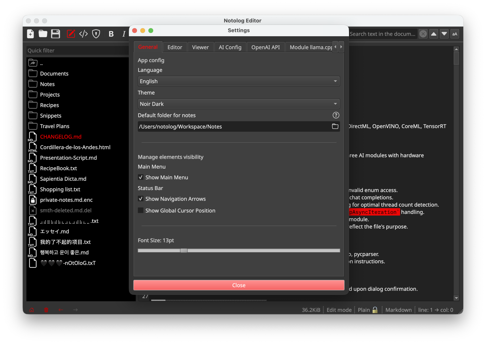

<!-- {"notolog.app": {"created": "2026-01-18 13:57:00.794379", "updated": "2026-01-24 00:00:00.000000"}} -->
# Configuration Guide

Detailed reference for all Notolog settings.

## Table of Contents

- [Settings Storage](#settings-storage)
- [General Tab](#general-tab)
- [Editor Tab](#editor-tab)
- [Viewer Tab](#viewer-tab)
- [AI Config Tab](#ai-config-tab)
- [AI Module Settings](#ai-module-settings)
- [Command Line](#command-line)

---


## Settings Storage

Settings are stored using Qt's QSettings in platform-specific locations:

| Platform | Location |
|----------|----------|
| Linux | `~/.config/Notolog/notolog_editor.conf` |
| macOS | `~/Library/Preferences/com.notolog.notolog_editor.plist` |
| Windows | Registry: `HKEY_CURRENT_USER\Software\Notolog\notolog_editor` |

---

## General Tab

The General tab contains app-wide configuration options.

### App Config

| Setting | Key | Default | Description |
|---------|-----|---------|-------------|
| Language | `app_language` | `en` | UI language selection |
| Theme | `app_theme` | `default` | Visual theme (default, calligraphy, nocturne, noir_dark, spooky, strawberry) |
| Default folder for notes | `default_path` | (empty) | Primary directory for notes |

### Elements Visibility

| Setting | Key | Default | Description |
|---------|-----|---------|-------------|
| Show Main Menu | `show_main_menu` | `true` | Display the app's main dropdown menu |

### Status Bar

| Setting | Key | Default | Description |
|---------|-----|---------|-------------|
| Show Navigation Arrows | `show_navigation_arrows` | `true` | Show navigation arrows in the status bar |
| Show Global Cursor Position | `show_global_cursor_position` | `true` | Display cursor position in status bar |

### Font Size

| Setting | Key | Default | Description |
|---------|-----|---------|-------------|
| Font Size | `app_font_size` | `12` | Global font size (range: 5-42) |

---

## Editor Tab

Editor-specific configuration options.

| Setting | Key | Default | Description |
|---------|-----|---------|-------------|
| Show Line Numbers | `show_line_numbers` | `true` | Display line numbers in the editor |

---

## Viewer Tab

Viewer-specific configuration options.

| Setting | Key | Default | Description                                                                                  |
|---------|-----|---------|----------------------------------------------------------------------------------------------|
| Convert Text Emojis to Graphics | `viewer_process_emojis` | `true` | Convert text emojis to graphical representations                                             |
| Highlight TODOs | `viewer_highlight_todos` | `true` | Emphasize @todo tags within the text                                                         |
| Require Confirmation to Open Links | `viewer_open_link_confirmation` | `true` | Ask for confirmation before opening external links in browser |
| Auto-save external images to disk | `viewer_save_resources` | `true` | Automatically saves copies of external images to disk for offline access                     |

---

## AI Config Tab

AI Assistant configuration options.

| Setting | Key | Default | Description |
|---------|-----|---------|-------------|
| Active Inference Module | `ai_config_inference_module` | (none) | Select from available AI inference modules |
| Multi-turn dialogue with conversational memory | `ai_config_multi_turn_dialogue` | `true` | Enable multi-turn dialogue that retains the previous prompt for conversational memory |
| Convert the result to Markdown | `ai_config_convert_to_md` | `false` | Convert the output message into Markdown format |

---

## AI Module Settings

Each AI module has its own settings tab in the Settings dialog.

### On-Device LLM (ONNX)

| Setting                 | Key | Default | Description |
|-------------------------|-----|---------|-------------|
| ONNX Model Location     | `module_ondevice_llm_model_path` | (empty) | Path to ONNX model directory |
| Temperature             | `module_ondevice_llm_response_temperature` | `20` | Response randomness (0-100, maps to 0.0-1.0) |
| Maximum Response Tokens | `module_ondevice_llm_response_max_tokens` | `0` | Maximum response tokens (0 = unlimited) |
| Hardware Acceleration   | `module_ondevice_llm_execution_provider` | `cpu` | Execution provider (CPU, CUDA, DirectML, etc.) |
| Prompt History Size     | `module_ondevice_llm_prompt_history_size` | `0` | Number of previous turns to remember |

### Module llama.cpp (GGUF)

| Setting                    | Key | Default | Description |
|----------------------------|-----|---------|-------------|
| Model Location             | `module_llama_cpp_model_path` | (empty) | Path to `.gguf` model file |
| Context Window Size        | `module_llama_cpp_context_window` | `2048` | Token context size (1-65536) |
| Chat Formats               | `module_llama_cpp_chat_format` | `auto` | Chat format template (chatml, llama-2, etc.) |
| System Prompt              | `module_llama_cpp_system_prompt` | (empty) | Initial instructions for the model |
| Response Temperature       | `module_llama_cpp_response_temperature` | `20` | Response randomness (0-100) |
| Max Tokens per Response    | `module_llama_cpp_response_max_tokens` | `0` | Maximum response tokens (0 = unlimited) |
| Size of the Prompt History | `module_llama_cpp_prompt_history_size` | `0` | Number of previous turns to remember |

### OpenAI API

| Setting                 | Key | Default | Description |
|-------------------------|-----|---------|-------------|
| API URL                 | `module_openai_api_url` | `https://api.openai.com/v1/chat/completions` | API endpoint URL |
| API Key                 | `module_openai_api_key` | (empty) | API key (stored encrypted) |
| Supported Models        | `module_openai_api_model` | `gpt-5` | Model name to use |
| System Prompt           | `module_openai_api_base_system_prompt` | (empty) | Initial instructions for the model |
| Temperature             | `module_openai_api_base_response_temperature` | `20` | Response randomness (0-100) |
| Maximum Response Tokens | `module_openai_api_base_response_max_tokens` | `0` | Maximum response tokens (0 = unlimited) |
| Prompt History Size     | `module_openai_api_prompt_history_size` | `0` | Number of previous turns to remember |

---

## Command Line

Notolog supports the following command-line options:

```bash
notolog --version  # Show version information
notolog --help     # Show help message
```

---

*For AI-specific configuration, see [AI Assistant Guide](ai-assistant.md).*

