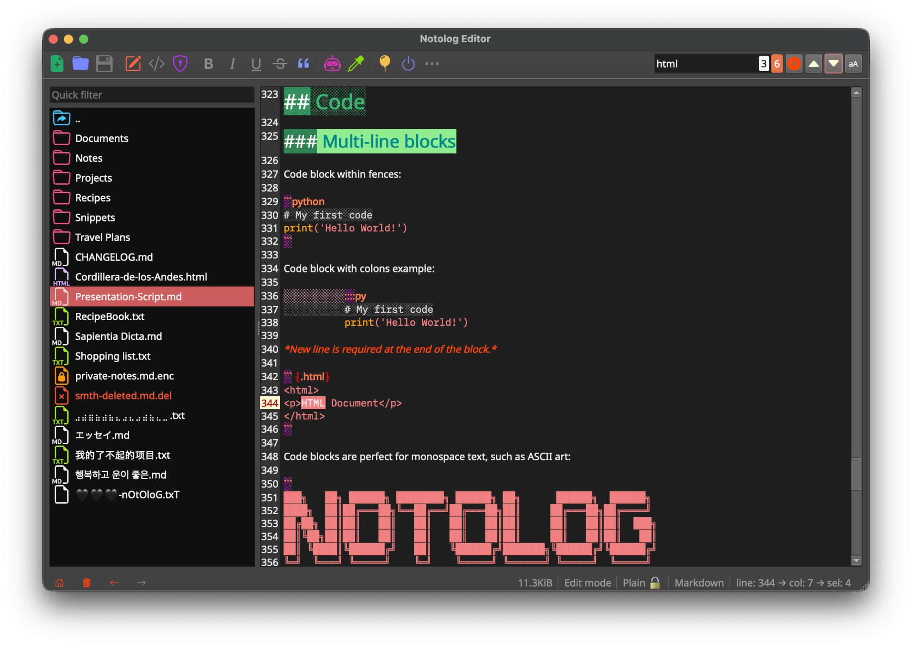

<!-- {"notolog.app": {"created": "2026-01-18 13:57:00.794379", "updated": "2026-01-31 00:00:00.000000"}} -->
# Notolog Documentation

[](https://pypi.org/project/notolog/)
[](https://github.com/notolog/notolog-editor/blob/master/LICENSE)
[](https://anaconda.org/conda-forge/notolog)

Welcome to the official documentation for **Notolog** - an open-source Markdown editor built with Python and PySide6.

## Quick Links

* [Getting Started](getting-started.md) - Installation and first steps
* [User Guide](user-guide.md) - Complete feature overview
* [Markdown Syntax](markdown-syntax.md) - Markdown syntax reference and examples
* [AI Assistant](ai-assistant.md) - Using AI features (OpenAI, ONNX, llama.cpp)
* [Configuration](configuration.md) - Settings and customization
* [API Reference](api-reference.md) - For developers and contributors
* [FAQ & Troubleshooting](faq.md) - Common questions and solutions

---


## What is Notolog?

Notolog is a privacy-focused Markdown editor that combines:

- **Clean Markdown editing** with syntax highlighting
- **AI-powered assistance** via OpenAI API or local LLMs (ONNX, GGUF)
- **File encryption** using AES-128 with Fernet
- **Multi-language support** (19 languages)
- **Customizable themes** (6 built-in themes)

## System Requirements

| Requirement | Minimum | Recommended |
|-------------|---------|-------------|
| Python | 3.10 | 3.11-3.12 (3.13 for ONNX GenAI) |
| OS | Windows 10, macOS 10.14, Ubuntu 20.04 | Latest stable versions |
| RAM | 4 GB (base editor) | 8 GB (16+ GB for local 7B+ parameter LLMs) |
| Storage | 100 MB (base) | 500 MB-4 GB (depends on local model files) |

!!! note "Local LLM Memory Requirements"
    - **Phi-3-mini (3.8B)**: ~4 GB VRAM or 8 GB RAM
    - **7B parameter models**: ~6 GB VRAM or 16 GB RAM
    - **13B parameter models**: ~10 GB VRAM or 24 GB RAM

## Installation Overview

```bash
# Using pip (recommended)
pip install notolog

# Using conda
conda install notolog -c conda-forge

# With llama.cpp support
pip install "notolog[llama]"
```

See [Getting Started](getting-started.md) for detailed installation instructions.

## Support

- **GitHub Issues**: [Report bugs or request features](https://github.com/notolog/notolog-editor/issues)
- **GitHub Discussions**: [Ask questions and discuss](https://github.com/notolog/notolog-editor/discussions)
- **Repository**: [github.com/notolog/notolog-editor](https://github.com/notolog/notolog-editor)
- **Website**: [notolog.app](https://notolog.app)

## License

Notolog is released under the [MIT License](https://github.com/notolog/notolog-editor/blob/main/LICENSE).

---

*Documentation version: 1.1.9*
