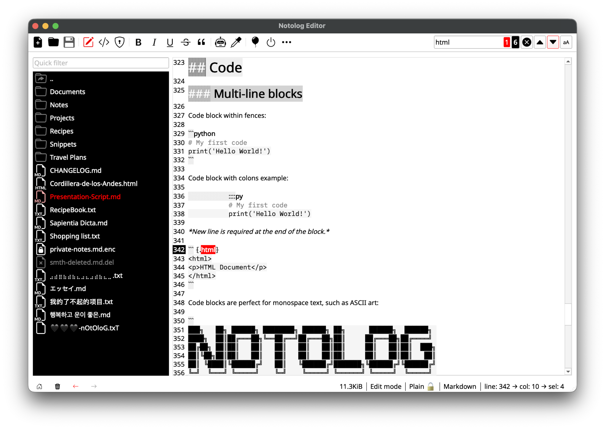

<!-- {"notolog.app": {"created": "2026-01-18 13:57:00.794379", "updated": "2026-01-31 00:00:00.000000"}} -->
# User Guide

Complete guide to all Notolog features and functionality.

## Table of Contents

- [Markdown Editing](#markdown-editing)
- [View Mode](#view-mode)
- [File Management](#file-management)
- [Search Features](#search-features)
- [Encryption](#encryption)
- [Themes](#themes)
- [Multi-Language Support](#multi-language-support)
- [Settings Overview](#settings-overview)

---

## Markdown Editing

### Syntax Highlighting

Notolog provides real-time syntax highlighting for:

- **Headers** (`# H1`, `## H2`, etc.)
- **Bold** (`**text**`) and *Italic* (`*text*`)
- **Code blocks** (fenced with ``` or indented)
- **Links** (`[text](https://notolog.app)`)
- **Lists** (ordered and unordered)
- **Blockquotes** (`> quote`)
- **Tables**
- **TODO items** (`@todo`)

### Supported Markdown Extensions

Notolog uses the Python Markdown library with these extensions:

| Extension       | Description |
|-----------------|-------------|
| `extra`         | Abbreviations, attribute lists, definition lists, fenced code, footnotes, tables, Markdown in HTML |
| `toc`           | Table of Contents with header anchors |
| `codehilite`    | Syntax highlighting for code blocks |

### Code Blocks

Fenced code blocks with language specification:

~~~markdown
```python
def hello():
    print("Hello, Notolog!")
```
~~~

### TODO Highlighting

The `@todo` tag is a Notolog-exclusive feature (not standard Markdown). It is highlighted in both Edit and View modes for easy task tracking:

```markdown
@todo Review documentation
@todo Add more examples
```

For more syntax examples, see the [Markdown Syntax Guide](markdown-syntax.md).

---

## View Mode

Toggle between Edit and View modes:

- **Edit Mode**: Write and modify Markdown
- **View Mode**: See rendered HTML output

### View Features

- Rendered Markdown with proper styling
- Clickable links (opens in browser)
- Syntax-highlighted code blocks
- Image display (local and remote) - see [Image Handling](#image-handling) below
- Table formatting

### Image Handling

Images are automatically:
1. Cached in memory for fast display
2. Optionally saved to a local `images` directory
3. Displayed with proper scaling

Configure in `Settings` → `Viewer` tab → `Auto-save external images to disk`.

---

## File Management

### File Tree

The left panel shows your notes directory:

- **Folders**: Displayed with folder icon
- **Markdown and plain text files**: `.md`, `.txt`, `.htm`, `.html`
- **Encrypted files**: `.enc` extension

### Creating Files and Folders

**New File**:

- Toolbar → `New File`

**New Folder**:

- Right-click on empty space in the file tree → `New Folder`

### Renaming and Deleting

- Right-click on file/folder → `Rename` or `Delete`
- Confirmation dialog prevents accidental deletion

**Litter Bin**: Deletion is reversible by default. Deleted files are marked as deleted but remain on disk. When the "Litter bin" option is active (icon below the file tree), deleted files are visible and can be:

- **Restored**: Right-click → Restore
- **Deleted completely**: Right-click → Delete completely

Note: When the Litter bin is inactive, deleted files are hidden from the file tree but still exist on disk and can be found via your system's file manager.

### File Meta-Headers

Notolog stores metadata in HTML comment headers:

```html
<!-- {"notolog.app": {"created": "2026-01-01 00:00:00", "updated": "2026-01-01 00:00:00", ...}} -->
# My Note
```

This preserves:
- Creation timestamp
- Last modification time
- Future: Custom metadata

---

## Search Features

### In-File Search

Press `Ctrl+F` to open the search bar:

- **Case Sensitive**: Toggle with button
- **Navigation**: Previous/Next match buttons
- **Counter**: Shows "X of Y" matches

### Quick File Filter

Type in the file tree search box to filter:

- Filters by filename
- Real-time filtering
- Clear with `X` button or `Esc`

---

## Encryption

Notolog provides AES-128 encryption for sensitive notes.

### Encryption Details

| Property | Value |
|----------|-------|
| Algorithm | AES-128 CBC (via Fernet) |
| Key Derivation | PBKDF2HMAC with SHA-256 |
| Iterations | 768,000 |
| Salt | 32 bytes, cryptographically random |

### Encrypting a File

1. Open the file you want to encrypt
2. Go to `File` → `Encrypt File` (or toolbar button)
3. Enter a strong password
4. Optionally add a password hint (avoid using personal info like date of birth - use something memorable yet unique that won't give clues if the file is accessed by others)
5. File is saved with `.enc` extension

### Opening Encrypted Files

1. Click on `.enc` file
2. Enter your password
3. File decrypts in memory
4. Edit and save as normal

### Password Best Practices

- Use strong, unique passwords
- Consider a password manager
- Password hints are stored unencrypted
- No password recovery - keep backups!

---

## Themes

Notolog includes 6 built-in themes:

| Theme | Description |
|-------|-------------|
| **Default** | Clean, neutral design |
| **Calligraphy** | Rice paper aesthetic with ink-style text |
| **Nocturne** | Dark theme for night work |
| **Noir Dark** | High-contrast dark theme |
| **Spooky** | Halloween-inspired colors |
| **Strawberry** | Playful, warm colors |

### Changing Themes

`Settings` → `General` tab → `Theme`

Changes apply immediately, no app reload needed.


---

## Multi-Language Support

Notolog supports 19 languages:

- English (default)
- Chinese (Simplified) - 简体中文
- Dutch - Nederlands
- Finnish - Suomi
- French - Français
- Georgian - ქართული
- German - Deutsch
- Greek - Ελληνικά
- Hindi - हिन्दी
- Indonesian - Bahasa Indonesia
- Italian - Italiano
- Japanese - 日本語
- Korean - 한국어
- Latin - Latina
- Portuguese - Português
- Russian - Русский
- Spanish - Español
- Swedish - Svenska
- Turkish - Türkçe

### Changing Language

`Settings` → `General` → `Language`

Instant, but in some cases restart may be required for full effect.

---

## Settings Overview

Access via `Settings` menu or toolbar.

### General Tab

- **Language**: UI language
- **Theme**: Visual theme selection
- **Default folder for notes**: Primary directory for notes
- **Show Main Menu**: Toggle main menu visibility
- **Show Navigation Arrows**: Display navigation arrows in the status bar
- **Show Global Cursor Position**: Display cursor position in the status bar
- **Font Size**: Adjust text size (range: 5-42)

### Editor Tab

- **Show Line Numbers**: Display line numbers in editor

### Viewer Tab

- **Convert Text Emojis to Graphics**: Render emojis graphically
- **Highlight TODOs**: Emphasize @todo tags
- **Require Confirmation to Open Links**: Show confirmation dialog before opening external links in your browser
- **Auto-save external images to disk**: Save downloaded images locally

### AI Config Tab

- **Active Inference Module**: Select from available AI inference modules
- **Multi-turn dialogue with conversational memory**: Enable multi-turn dialogue that retains the previous prompt
- **Convert the result to Markdown**: Convert AI output to Markdown format

See [AI Assistant Guide](ai-assistant.md) for AI module-specific settings.

---

*For AI features, continue to the [AI Assistant Guide](ai-assistant.md).*
